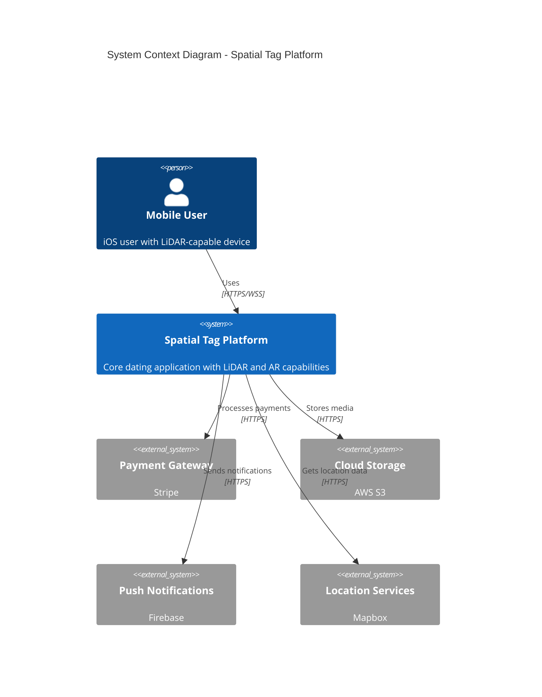

# Spatial Tag Platform

[](https://github.com/spatial-tag/platform/actions)
[](https://github.com/spatial-tag/platform/releases)
[](LICENSE)

A revolutionary dating platform leveraging LiDAR technology and spatial awareness to create authentic connections through shared physical spaces.

## Project Overview

Spatial Tag represents a new paradigm in social connection, combining cutting-edge LiDAR capabilities with location-based digital "tags" to enable meaningful discoveries and interactions. The platform serves tech-savvy urban professionals aged 18-35, focusing on creating authentic connections beyond traditional profile-based matching.

### Key Features

- Real-time LiDAR-based environment mapping and user detection (50-meter radius)
- Location-anchored digital tags with customizable content
- AR overlay for discovering nearby users and tags
- Tiered user classification system (Elite/Rare status)
- Integrated commerce platform with shared wishlists

### Technology Stack

- **iOS Client**: Swift 5.9+, ARKit 6.0, Core Location
- **Spatial Engine**: Rust 1.74+ with CUDA support
- **Tag Service**: Go 1.21+
- **User Service**: Node.js 20 LTS
- **Commerce Service**: Python 3.11+
- **Databases**: PostgreSQL 15, MongoDB 6.0, Redis 7.0
- **Infrastructure**: AWS (EKS, RDS, ElastiCache, S3)

## Getting Started

### Prerequisites

- Xcode 15+ for iOS development
- LiDAR-capable iOS device (iPhone 12 Pro or newer)
- Docker Desktop for local service development
- AWS CLI configured with appropriate credentials
- Terraform 1.6+ for infrastructure management

### Installation

1. Clone the repository:
```bash
git clone https://github.com/spatial-tag/platform.git
cd platform
```

2. Install backend dependencies:
```bash
cd src/backend
make install
```

3. Install iOS dependencies:
```bash
cd src/ios
pod install
```

4. Configure environment:
```bash
cp .env.example .env
# Edit .env with your configuration
```

### Development Workflow

1. Start local services:
```bash
docker-compose up -d
```

2. Run migrations:
```bash
make migrate
```

3. Start development servers:
```bash
make dev
```

## Architecture



## Development

### Backend Services

Each service follows domain-driven design principles and implements a hexagonal architecture:

- `api-gateway`: Request routing and authentication (Node.js)
- `spatial-engine`: LiDAR processing and spatial calculations (Rust)
- `tag-service`: Tag lifecycle management (Go)
- `user-service`: Profile and preference management (Node.js)
- `commerce-service`: Transaction and wishlist handling (Python)

### iOS Application

The iOS app is built using SwiftUI and follows the MVVM architecture pattern. Key components:

- `SpatialEngine`: LiDAR processing and spatial awareness
- `TagManager`: Tag creation and interaction
- `UserDiscovery`: Nearby user detection
- `AROverlay`: Augmented reality visualization

## Deployment

### Infrastructure Setup

1. Initialize Terraform:
```bash
cd infrastructure
terraform init
```

2. Deploy infrastructure:
```bash
terraform plan
terraform apply
```

### CI/CD Pipeline

The platform uses GitHub Actions for continuous integration and deployment:

- Build and test on every push
- Automated deployments to staging
- Manual approval for production deployments
- Security scanning with SonarQube and Snyk

## Contributing

### Pull Request Process

1. Fork the repository
2. Create a feature branch
3. Implement changes with tests
4. Submit PR with detailed description
5. Pass code review and CI checks
6. Merge after approval

### Code Style

- Swift: Follow Apple's Swift style guide
- Go: Use `gofmt` and Go idioms
- Python: Follow PEP 8
- JavaScript: Use ESLint with Airbnb config
- Rust: Follow Rust style guidelines

## Security

### Authentication Flow

- JWT-based authentication
- Refresh token rotation
- Biometric authentication support
- Rate limiting and brute force protection

### Data Protection

- End-to-end encryption for messages
- AES-256 for data at rest
- TLS 1.3 for data in transit
- Regular security audits

## Performance

### Benchmarks

- API response time: < 100ms
- AR overlay refresh: 30Hz minimum
- Battery usage: < 15% per hour
- Location accuracy: ±1cm at 10m

### Monitoring

- Prometheus for metrics
- Grafana for visualization
- ELK stack for logging
- PagerDuty for alerts

## Troubleshooting

### Common Issues

1. LiDAR Calibration
2. Tag Placement Accuracy
3. Real-time Updates
4. Battery Optimization

### Support

- GitHub Issues for bug reports
- Technical documentation in `/docs`
- Community Discord server
- Premium support for enterprise customers

## API Documentation

Comprehensive API documentation is available at `/docs/api`:

- OpenAPI 3.0 specification
- Authentication guides
- Endpoint references
- WebSocket documentation

## License

This project is licensed under the MIT License - see the [LICENSE](LICENSE) file for details.