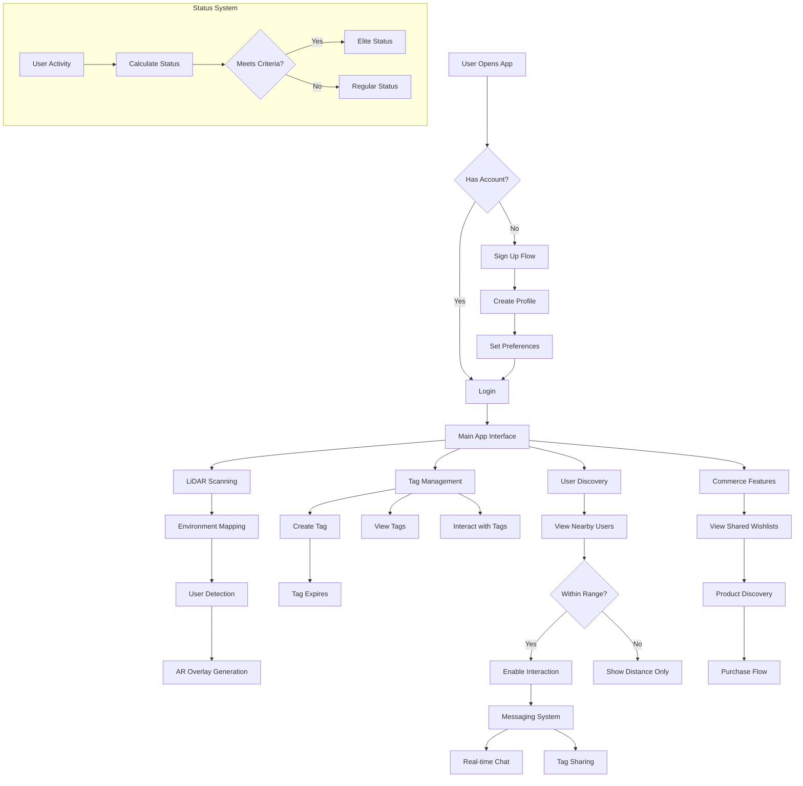
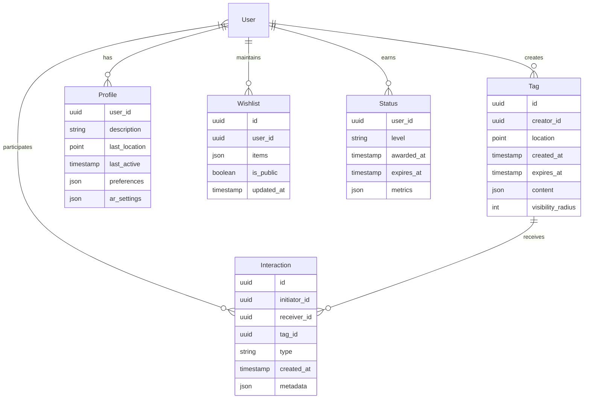
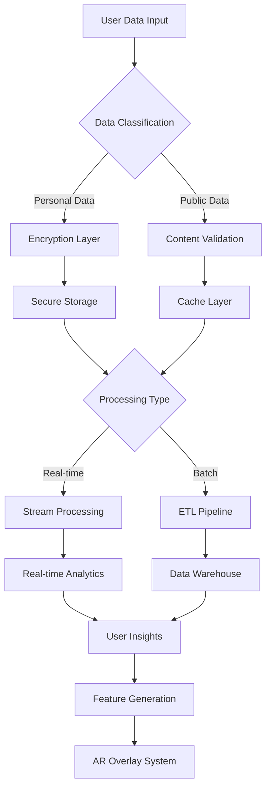
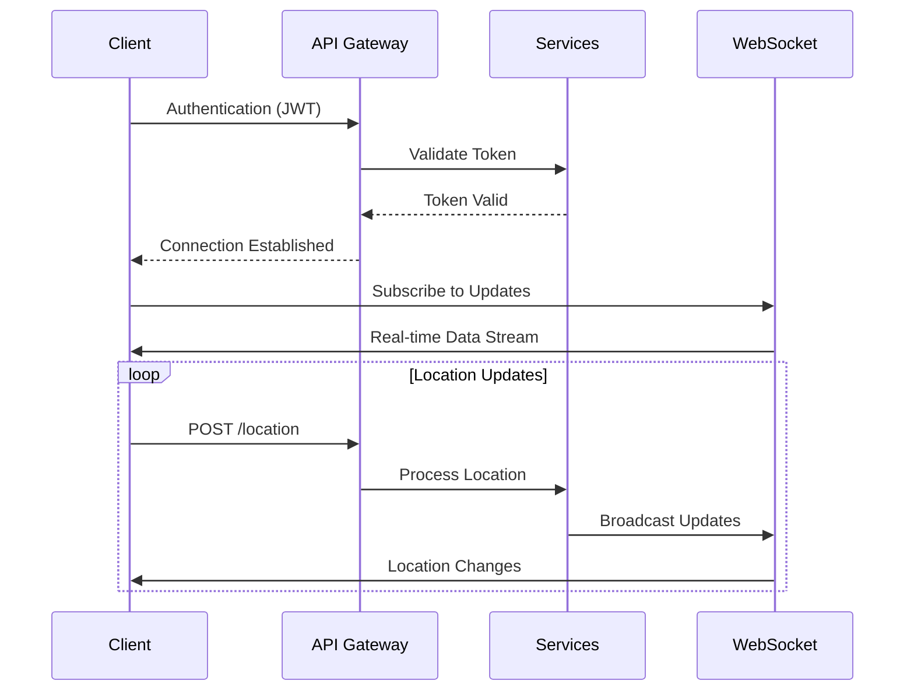

# Product Requirements Document (PRD)

# 1. INTRODUCTION

## 1.1 Purpose

This Product Requirements Document (PRD) specifies the requirements for the development of "Spatial Tag," a LiDAR-enabled dating application. The document serves as a comprehensive reference for:

- Development and engineering teams implementing the core functionality
- UX/UI designers creating the user interface and experience
- Product managers overseeing feature development and rollout
- Quality assurance teams validating system requirements
- Stakeholders evaluating project scope and progress

## 1.2 Scope

Spatial Tag is a revolutionary dating application that leverages LiDAR technology and spatial awareness to facilitate real-world connections. The system encompasses:

### Core Functionalities
- LiDAR-based spatial mapping and user detection
- Location-based digital "tag" creation and discovery
- Real-time AR overlay of nearby users and tags
- Tiered status system (Elite/Rare designations)
- Shared wishlist and commerce integration
- Ephemeral tag lifecycle management

### Key Benefits
- Enhanced real-world interaction through technology
- Reduced reliance on traditional profile-based matching
- Gamified social discovery through spatial awareness
- Seamless integration of social connection and commerce
- Privacy-focused approach through proximity-based visibility
- Exclusive and time-sensitive interaction opportunities

### Target Market
- Tech-savvy young adults (18-35)
- Urban dwellers in metropolitan areas
- Early adopters of AR/spatial technology
- Fashion and lifestyle-conscious consumers
- Users seeking alternative dating experiences

The system will be initially deployed as an iOS application with potential for Android expansion, requiring iOS devices with LiDAR capability.

# 2. PRODUCT DESCRIPTION

## 2.1 Product Perspective

Spatial Tag operates as a standalone iOS application that integrates with several key system components:

- Device LiDAR sensors for spatial mapping and user detection
- iOS ARKit framework for augmented reality overlays
- Cloud infrastructure for user data and tag storage
- Payment processing systems for commerce integration
- Push notification services for real-time alerts
- Location services for proximity-based features
- Social authentication providers for user verification

## 2.2 Product Functions

The primary functions of Spatial Tag include:

- **Spatial Mapping and Detection**
  - Real-time LiDAR environment scanning
  - User proximity detection and tracking
  - Digital tag creation and placement
  - AR overlay visualization

- **User Interaction System**
  - Profile creation and management
  - Tag discovery and interaction
  - Real-time messaging within proximity
  - Status system progression (Elite/Rare)

- **Commerce Integration**
  - Shared wishlist creation
  - Product discovery and recommendations
  - Collaborative shopping experiences
  - Purchase tracking and history

- **Tag Lifecycle Management**
  - Time-based tag expiration
  - Location-based tag visibility
  - Tag interaction tracking
  - Historical tag analytics

## 2.3 User Characteristics

### Primary User Persona: Tech-Forward Urban Professional
- Age: 25-35
- Location: Metropolitan areas
- Tech-savvy with latest iOS devices
- Active social life and shopping habits
- Values unique experiences and exclusivity

### Secondary User Persona: Creative Early Adopter
- Age: 18-24
- Location: Urban/University areas
- Early technology adopter
- Fashion and trend-conscious
- Highly engaged in social media

### User Requirements
- iOS device with LiDAR capability
- Basic understanding of AR interactions
- Comfort with location-based services
- Active lifestyle for maximum feature utilization

## 2.4 Constraints

### Technical Constraints
- iOS devices with LiDAR sensors only (iPhone 12 Pro and newer)
- Minimum iOS version 15.0
- Reliable internet connectivity required
- GPS accuracy limitations in indoor spaces
- Battery life considerations for continuous LiDAR usage

### Business Constraints
- Initial launch limited to major metropolitan areas
- Regulatory compliance with dating app regulations
- Privacy laws and GDPR compliance
- App Store guidelines adherence
- Payment processing fees

### Security Constraints
- User verification requirements
- Data encryption standards
- Location data privacy
- Payment information protection
- User content moderation

## 2.5 Assumptions and Dependencies

### Assumptions
- Users have consistent internet access
- Target demographic owns compatible iOS devices
- Users are comfortable with location sharing
- Sufficient market demand for spatial dating
- Users will engage with commerce features

### Dependencies
- Apple's ARKit framework stability
- iOS LiDAR sensor availability
- Cloud service providers
- Payment gateway services
- Social authentication providers
- Map service providers
- Push notification services
- Content delivery networks

# 3. PROCESS FLOWCHART

# 4. FUNCTIONAL REQUIREMENTS

## 4.1 Spatial Mapping and Detection

### ID: F1
### Description
Core LiDAR-based functionality for environment scanning and user detection
### Priority
Critical (P0)
### Requirements

| ID | Requirement | Priority |
|---|---|---|
| F1.1 | System shall continuously scan environment using LiDAR sensor | P0 |
| F1.2 | System shall detect and track other users within 50-meter radius | P0 |
| F1.3 | System shall generate 3D spatial map of surroundings | P0 |
| F1.4 | System shall update user positions in real-time (minimum 1Hz refresh) | P0 |
| F1.5 | System shall maintain spatial accuracy within 0.5 meters | P1 |

## 4.2 Tag Management System

### ID: F2
### Description
Creation, placement, and interaction with digital tags in physical space
### Priority
Critical (P0)
### Requirements

| ID | Requirement | Priority |
|---|---|---|
| F2.1 | Users shall be able to create and place digital tags at current location | P0 |
| F2.2 | Tags shall include customizable text, media, and expiration time | P0 |
| F2.3 | System shall enforce tag visibility based on user proximity | P0 |
| F2.4 | Tags shall automatically expire after set duration (1-24 hours) | P1 |
| F2.5 | Users shall be able to interact with tags through AR interface | P1 |

## 4.3 User Discovery and Interaction

### ID: F3
### Description
Proximity-based user discovery and communication features
### Priority
Critical (P0)
### Requirements

| ID | Requirement | Priority |
|---|---|---|
| F3.1 | System shall display nearby users in AR overlay | P0 |
| F3.2 | Users shall be able to initiate chat when within 20 meters | P0 |
| F3.3 | System shall calculate and display real-time distance to other users | P0 |
| F3.4 | System shall support user filtering based on preferences | P1 |
| F3.5 | System shall enable tag sharing between connected users | P1 |

## 4.4 Status System

### ID: F4
### Description
Elite and Rare status designation and management
### Priority
High (P1)
### Requirements

| ID | Requirement | Priority |
|---|---|---|
| F4.1 | System shall track user activity metrics for status calculation | P1 |
| F4.2 | System shall award Elite status based on defined criteria | P1 |
| F4.3 | System shall display user status indicators in AR overlay | P1 |
| F4.4 | System shall provide exclusive features for Elite status users | P2 |
| F4.5 | System shall recalculate status weekly | P2 |

## 4.5 Commerce Integration

### ID: F5
### Description
Shared wishlist and shopping features
### Priority
Medium (P2)
### Requirements

| ID | Requirement | Priority |
|---|---|---|
| F5.1 | Users shall be able to create and share wishlists | P2 |
| F5.2 | System shall support product discovery and recommendations | P2 |
| F5.3 | System shall enable collaborative shopping experiences | P2 |
| F5.4 | System shall track purchase history and preferences | P2 |
| F5.5 | System shall integrate with third-party payment processors | P2 |

## 4.6 AR Overlay System

### ID: F6
### Description
Augmented reality visualization of users, tags, and interactions
### Priority
High (P1)
### Requirements

| ID | Requirement | Priority |
|---|---|---|
| F6.1 | System shall render AR elements using ARKit framework | P0 |
| F6.2 | System shall maintain stable AR anchor points | P1 |
| F6.3 | System shall provide visual indicators for interaction zones | P1 |
| F6.4 | System shall support custom AR filters and effects | P2 |
| F6.5 | System shall optimize AR rendering for battery efficiency | P1 |

# 5. NON-FUNCTIONAL REQUIREMENTS

## 5.1 Performance Requirements

| ID | Requirement | Target Metric |
|---|---|---|
| P1 | LiDAR scanning refresh rate | ≥ 30Hz |
| P2 | AR overlay rendering latency | < 50ms |
| P3 | User location update frequency | ≥ 1Hz |
| P4 | Maximum concurrent users per area | 1000 users/km² |
| P5 | Tag interaction response time | < 200ms |
| P6 | Battery consumption | ≤ 15% per hour of active use |
| P7 | Application launch time | < 3 seconds |
| P8 | Maximum memory usage | ≤ 500MB |

## 5.2 Safety Requirements

| ID | Requirement | Description |
|---|---|---|
| S1 | Automatic session termination | Terminate user sessions after 30 minutes of inactivity |
| S2 | Data backup frequency | Hourly incremental, daily full backup |
| S3 | Failure recovery | System restore point creation every 24 hours |
| S4 | Emergency shutdown | Graceful shutdown procedure for critical failures |
| S5 | User distance limits | Minimum 2-meter separation for tag placement |
| S6 | Anti-harassment measures | Automatic blocking after 3 reported incidents |

## 5.3 Security Requirements

| ID | Requirement | Description |
|---|---|---|
| SE1 | User authentication | Multi-factor authentication for all accounts |
| SE2 | Data encryption | AES-256 encryption for all stored data |
| SE3 | Communication security | TLS 1.3 for all network communications |
| SE4 | Location data privacy | Location data anonymization after 24 hours |
| SE5 | Payment security | PCI DSS compliance for all transactions |
| SE6 | Access control | Role-based access control (RBAC) system |
| SE7 | Audit logging | Comprehensive activity logging with 90-day retention |

## 5.4 Quality Requirements

### 5.4.1 Availability
- System uptime: 99.9% excluding planned maintenance
- Maximum planned downtime: 4 hours per month
- Disaster recovery time: < 4 hours

### 5.4.2 Maintainability
- Code documentation coverage: ≥ 90%
- Maximum technical debt ratio: 5%
- Automated test coverage: ≥ 85%

### 5.4.3 Usability
- First-time user task completion: ≥ 80%
- User error rate: < 1%
- Help documentation response time: < 24 hours

### 5.4.4 Scalability
- Linear scaling up to 1 million active users
- Auto-scaling trigger at 70% resource utilization
- Maximum database growth: 1TB per month

### 5.4.5 Reliability
- Mean Time Between Failures (MTBF): ≥ 720 hours
- Mean Time To Recovery (MTTR): < 30 minutes
- Maximum data loss in failure: 5 minutes of data

## 5.5 Compliance Requirements

| ID | Requirement | Description |
|---|---|---|
| C1 | GDPR compliance | Full compliance with EU data protection regulations |
| C2 | CCPA compliance | California Consumer Privacy Act requirements |
| C3 | App Store guidelines | Adherence to Apple App Store guidelines |
| C4 | Age verification | COPPA compliance for user age verification |
| C5 | Accessibility | WCAG 2.1 Level AA compliance |
| C6 | Data retention | Data retention policies as per local regulations |
| C7 | Location services | Compliance with location privacy regulations |
| C8 | Payment processing | Compliance with financial regulations and standards |

# 6. DATA REQUIREMENTS

## 6.1 Data Models

## 6.2 Data Storage

### 6.2.1 Primary Storage Systems

| Data Type | Storage System | Retention Period |
|-----------|---------------|------------------|
| User Profiles | PostgreSQL | Account lifetime |
| Tags | MongoDB | 30 days post-expiration |
| Spatial Data | Redis Geospatial | 24 hours active cache |
| Media Content | S3-compatible Object Storage | 90 days |
| Interaction History | TimescaleDB | 12 months |
| Analytics Data | ClickHouse | 24 months |

### 6.2.2 Backup and Recovery

| Component | Backup Frequency | Retention | Recovery Time Objective |
|-----------|-----------------|-----------|------------------------|
| User Data | Hourly | 30 days | 1 hour |
| Spatial Data | Daily | 7 days | 15 minutes |
| Media Content | Weekly | 90 days | 4 hours |
| Transaction Logs | Real-time | 30 days | 5 minutes |

### 6.2.3 Data Redundancy

- Geographic replication across 3 regions
- Active-active configuration for spatial data
- Multi-AZ deployment for primary databases
- Cross-region replication for object storage
- Hot standby instances for critical services

## 6.3 Data Processing

### 6.3.1 Data Security Measures

| Security Layer | Implementation |
|----------------|----------------|
| Encryption at Rest | AES-256 |
| Encryption in Transit | TLS 1.3 |
| Access Control | RBAC with JWT |
| Data Masking | PII Redaction |
| Audit Logging | ELK Stack |

### 6.3.2 Data Processing Requirements

| Process Type | Latency Requirement | Throughput |
|-------------|---------------------|------------|
| Spatial Updates | < 100ms | 10K ops/sec |
| Tag Processing | < 200ms | 5K ops/sec |
| User Discovery | < 300ms | 2K ops/sec |
| Analytics | < 1s | 1K ops/sec |
| Media Processing | < 5s | 100 ops/sec |

### 6.3.3 Data Validation Rules

| Data Type | Validation Requirements |
|-----------|------------------------|
| Location Data | Valid GPS coordinates within service area |
| Tags | Maximum 1KB payload, valid expiration time |
| User Content | Content moderation, size limits |
| Media | Format verification, malware scanning |
| Profile Data | Required fields, format validation |

# 7. EXTERNAL INTERFACES

## 7.1 User Interfaces

### 7.1.1 Mobile Application Interface

| Screen | Primary Functions | Key Requirements |
|--------|------------------|------------------|
| AR View | - Real-time LiDAR scanning overlay - Tag visualization - User proximity indicators | - 60 FPS minimum refresh rate - Intuitive distance indicators - Clear status badges |
| Tag Creation | - Spatial tag placement - Media attachment - Expiration setting | - One-handed operation - Quick access gestures - Real-time preview |
| Profile Management | - Status display - Wishlist management - Preference settings | - Minimalist design - Quick status updates - Easy navigation |
| Discovery Feed | - Nearby user display - Tag browsing - Interaction history | - Infinite scroll - Pull-to-refresh - Filter controls |

### 7.1.2 Design Requirements

- Dark mode by default
- High contrast for AR elements
- Haptic feedback for interactions
- Accessibility compliance (WCAG 2.1)
- Support for dynamic text sizing
- Left/right-handed mode switching

## 7.2 Hardware Interfaces

### 7.2.1 LiDAR Sensor Interface

| Component | Specification | Requirements |
|-----------|--------------|--------------|
| LiDAR Scanner | iPhone Pro models | - Minimum scan rate: 30Hz - Range: 0.5-50m - Precision: ±1cm |
| Camera System | Wide + Ultra-wide | - Minimum 12MP - 4K video support - HDR capability |
| Motion Sensors | Gyroscope + Accelerometer | - 100Hz sampling rate - ±0.1° accuracy |
| GPS | A-GPS, GLONASS | - Accuracy: ±5m outdoor - Update rate: 1Hz |

### 7.2.2 Device Requirements

- Minimum iOS device: iPhone 12 Pro
- Minimum RAM: 6GB
- Storage: 256MB app size
- Battery optimization for LiDAR usage
- Thermal management support

## 7.3 Software Interfaces

### 7.3.1 Framework Integration

| Framework | Purpose | Integration Requirements |
|-----------|---------|------------------------|
| ARKit 6.0+ | AR visualization | - Scene anchoring - Spatial mapping - Object detection |
| Core Location | Location services | - Background location - Geofencing - Region monitoring |
| Core Data | Local storage | - Encryption support - Migration handling - Versioning |
| StoreKit | Commerce integration | - In-app purchases - Subscription management |

### 7.3.2 Third-Party Services

| Service | Integration Type | Requirements |
|---------|-----------------|--------------|
| Stripe | Payment processing | - SDK version 8.0+ - PCI compliance - 3D Secure 2.0 |
| AWS S3 | Media storage | - Direct upload - CDN integration - Lifecycle policies |
| Firebase | Analytics/Messaging | - Real-time events - Push notifications - Crash reporting |
| Mapbox | Location rendering | - Custom styling - Offline support - Vector tiles |

## 7.4 Communication Interfaces

### 7.4.1 Network Protocols

| Protocol | Usage | Requirements |
|----------|-------|--------------|
| HTTPS | API communication | - TLS 1.3 - Certificate pinning - HSTS enabled |
| WebSocket | Real-time updates | - Secure WebSocket - Auto-reconnection - Heartbeat monitoring |
| MQTT | Location updates | - QoS Level 1 - Retained messages - Topic filtering |

### 7.4.2 API Requirements

### 7.4.3 Data Exchange Formats

| Format | Usage | Specifications |
|--------|-------|---------------|
| JSON | API responses | - Compression enabled - Schema validation - UTF-8 encoding |
| Protocol Buffers | Location data | - Version 3 - Custom messages - Binary encoding |
| MessagePack | Real-time updates | - Binary JSON - Compact encoding - Fast serialization |

# 8. APPENDICES

## 8.1 GLOSSARY

| Term | Definition |
|------|------------|
| Digital Tag | A virtual marker placed in physical space using LiDAR technology that contains user-created content |
| Elite Status | A privileged user designation earned through high engagement and quality interactions |
| Rare Status | A temporary designation indicating unique or limited-time user achievements |
| Spatial Mapping | The process of creating a digital representation of physical space using LiDAR technology |
| Tag Lifecycle | The duration from creation to expiration of a digital tag in the system |
| Wishlist | A curated collection of products and experiences shared between connected users |
| Proximity Zone | The defined radius within which users can interact with tags and other users |
| AR Overlay | The augmented reality visualization layer displaying tags and user information |

## 8.2 ACRONYMS

| Acronym | Expansion |
|---------|-----------|
| AR | Augmented Reality |
| LiDAR | Light Detection and Ranging |
| GPS | Global Positioning System |
| API | Application Programming Interface |
| SDK | Software Development Kit |
| JWT | JSON Web Token |
| RBAC | Role-Based Access Control |
| MQTT | Message Queuing Telemetry Transport |
| CDN | Content Delivery Network |
| HSTS | HTTP Strict Transport Security |
| QoS | Quality of Service |
| PII | Personally Identifiable Information |
| WCAG | Web Content Accessibility Guidelines |
| COPPA | Children's Online Privacy Protection Act |
| GDPR | General Data Protection Regulation |
| CCPA | California Consumer Privacy Act |

## 8.3 ADDITIONAL REFERENCES

| Reference | Description | URL |
|-----------|-------------|-----|
| Apple ARKit Documentation | Official documentation for AR implementation | https://developer.apple.com/documentation/arkit |
| LiDAR Scanner API | Technical specifications for LiDAR integration | https://developer.apple.com/documentation/arkit/arsession |
| iOS Human Interface Guidelines | Design standards for iOS applications | https://developer.apple.com/design/human-interface-guidelines |
| GDPR Compliance Guide | Privacy compliance requirements | https://gdpr.eu/compliance |
| WebSocket Protocol | Real-time communication protocol specification | https://datatracker.ietf.org/doc/html/rfc6455 |
| MongoDB Geospatial Queries | Documentation for spatial data storage | https://docs.mongodb.com/manual/geospatial-queries |
| Redis Geospatial | Guide for implementing location-based features | https://redis.io/commands/geospatial |
| Stripe API Reference | Payment processing integration guide | https://stripe.com/docs/api |