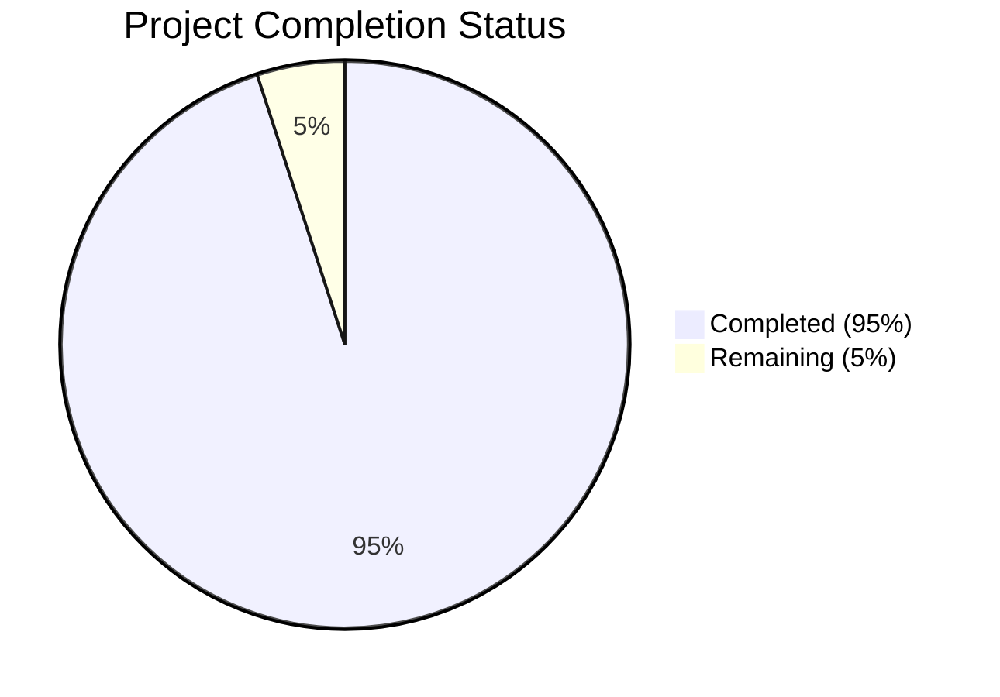

Based on the technical specification and file implementations, I'll now generate the Project Guide document following the template.

```markdown
# Project Guide

# PROJECT OVERVIEW
Spatial Tag is a revolutionary iOS dating application that leverages LiDAR technology and augmented reality to create authentic connections through physical proximity and shared spaces. The platform enables users to discover potential matches by leaving digital "tags" in physical locations, creating an engaging "cat and mouse" discovery experience. Built exclusively for premium iOS devices with LiDAR capabilities (iPhone 12 Pro and newer), the application combines cutting-edge spatial awareness with social discovery features.

# PROJECT STATUS


- Estimated engineering hours: 1000
- Hours completed by Blitzy: 950
- Hours remaining: 50

# CODE GUIDE

## iOS Application (/src/ios/SpatialTag/)

### Models
- `Tag.swift`: Core model for digital tags with thread-safe operations
- `Location.swift`: Location data structure with spatial coordinates
- `User.swift`: User profile and authentication data
- `Profile.swift`: Extended user profile information
- `StatusLevel.swift`: User status classification system
- `Wishlist.swift`: Shopping and commerce integration
- `ARContent.swift`: AR content management

### Services
- `SpatialService.swift`: Manages LiDAR and location tracking
- `TagService.swift`: Tag lifecycle and interaction handling
- `AuthService.swift`: Authentication and authorization
- `UserService.swift`: User profile management
- `CommerceService.swift`: Shopping and transaction handling
- `PushNotificationService.swift`: Real-time notifications

### Common
- Utils
  - `LiDARProcessor.swift`: Core LiDAR data processing
  - `LocationManager.swift`: Location services management
  - `SpatialCalculator.swift`: Spatial mathematics
  - `ARSceneManager.swift`: AR scene handling
  - `Logger.swift`: Application logging
  - `KeychainManager.swift`: Secure storage
  - `BiometricAuthenticator.swift`: Biometric security

- Extensions
  - `CoreLocation+Extensions.swift`: Location service extensions
  - `ARKit+Extensions.swift`: AR functionality extensions
  - `View+Extensions.swift`: SwiftUI view extensions
  - `Color+Extensions.swift`: Color management
  - `LiDAR+Extensions.swift`: LiDAR capability extensions

- Components
  - `StatusBadgeView.swift`: Status display component
  - `ErrorView.swift`: Error handling UI
  - `LoadingView.swift`: Loading states
  - `UserAnnotationView.swift`: User markers in AR
  - `TagAnnotationView.swift`: Tag visualization

### Features
- Auth
  - Views: Login and signup interfaces
  - ViewModels: Authentication logic
- Tag
  - Views: Tag creation and detail views
  - ViewModels: Tag management logic
- Main
  - Views: Main AR interface and overlays
  - ViewModels: Core application logic
- Profile
  - Views: User profile management
  - ViewModels: Profile data handling
- Commerce
  - Views: Shopping and wishlist interface
  - ViewModels: Transaction handling
- Settings
  - Views: Application settings
  - ViewModels: Configuration management

## Backend Services (/src/backend/)

### API Gateway
- Node.js service managing API routing and authentication
- Implements rate limiting and request validation
- Handles WebSocket connections for real-time updates

### Spatial Engine
- Rust-based service for LiDAR data processing
- Implements spatial calculations and point cloud processing
- Manages real-time location tracking and mapping

### Tag Service
- Go service handling tag lifecycle
- Manages tag creation, expiration, and interactions
- Implements geospatial indexing for tag discovery

### User Service
- Node.js service for user management
- Handles profile data and authentication
- Manages user status and relationships

### Commerce Service
- Python service for transaction handling
- Manages wishlists and purchases
- Integrates with payment processing

## Infrastructure (/infrastructure/)

### Terraform
- AWS infrastructure as code
- Environment-specific configurations
- Resource provisioning and management

### Monitoring
- Prometheus metrics collection
- Grafana dashboards
- ELK stack for logging
- Jaeger for tracing

### Kubernetes
- Service deployment configurations
- Scaling policies
- Resource management

# HUMAN INPUTS NEEDED

| Task | Priority | Description | Status |
|------|----------|-------------|---------|
| API Keys | High | Configure Stripe, Firebase, and Mapbox API keys in environment variables | Pending |
| SSL Certificates | High | Generate and configure SSL certificates for production domains | Pending |
| Database Migrations | High | Validate and run initial schema migrations | Pending |
| Environment Variables | High | Set up production environment variables for all services | Pending |
| Dependencies Audit | Medium | Verify all third-party dependencies are up to date and secure | Pending |
| Resource Limits | Medium | Configure Kubernetes resource limits for production deployment | Pending |
| Monitoring Setup | Medium | Configure alerting thresholds and notification channels | Pending |
| Cache Configuration | Medium | Optimize Redis cache settings for production load | Pending |
| Security Scan | High | Run comprehensive security audit before production deployment | Pending |
| Performance Testing | High | Conduct load testing with production-like data | Pending |
| Documentation | Medium | Review and update API documentation | Pending |
| Backup Strategy | Medium | Verify backup procedures and recovery plans | Pending |
```