# Technical Specifications

# 1. INTRODUCTION

## 1.1 EXECUTIVE SUMMARY

Spatial Tag represents a revolutionary approach to social connection through technology, leveraging LiDAR capabilities and spatial awareness to create a unique dating application. The system addresses the fundamental disconnect between digital dating platforms and real-world interactions by enabling users to discover and connect with others through physical proximity and shared spaces.

The platform serves tech-savvy urban professionals aged 18-35 who seek authentic connections beyond traditional profile-based matching. By combining LiDAR technology, augmented reality, and location-based digital "tags," Spatial Tag creates an engaging ecosystem where users can leave digital breadcrumbs in physical spaces, discover potential matches through spatial awareness, and build connections through shared experiences and interests. The users should engage in a responsive cat and mouse game in which they begin to discover each other by each engagement leading to another. 

## 1.2 SYSTEM OVERVIEW

### Project Context

| Aspect | Description |
| --- | --- |
| Market Position | First-to-market LiDAR-enabled dating platform targeting premium iOS users |
| Current Limitations | Traditional dating apps lack real-world context and authentic discovery mechanisms |
| Enterprise Integration | Standalone application with commerce platform integration capabilities |

### High-Level Description

| Component | Implementation |
| --- | --- |
| Spatial Engine | LiDAR-based environment mapping and user detection within 50-meter radius |
| Tag System | Location-anchored digital markers with customizable content and expiration |
| Discovery Layer | AR overlay displaying nearby users, tags, and interaction opportunities |
| Status Framework | Tiered user classification system (Elite/Rare) based on engagement metrics |
| Commerce Integration | Shared wishlist and collaborative shopping experience platform |

### Success Criteria

| KPI Category | Target Metrics |
| --- | --- |
| User Engagement | - 30% daily active user rate<br>- Average 15-minute session duration<br>- 5 tags created per active user weekly |
| Technical Performance | - 99.9% system uptime<br>- \< 100ms response time<br>- \< 15% battery drain per hour |
| Business Metrics | - 25% user-to-match conversion rate<br>- 40% retention rate after 3 months<br>- 15% premium user conversion |

## 1.3 SCOPE

### In-Scope Elements

#### Core Features and Functionalities

| Feature Category | Included Capabilities |
| --- | --- |
| Spatial Mapping | - Real-time LiDAR scanning<br>- User proximity detection<br>- Environmental mapping<br>- AR visualization |
| Tag System | - Tag creation and placement<br>- Content management<br>- Expiration handling<br>- Interaction tracking |
| User Experience | - Profile management<br>- Discovery interface<br>- Real-time messaging<br>- Status progression |
| Commerce | - Wishlist creation<br>- Product discovery<br>- Purchase integration<br>- Shared shopping experience |

#### Implementation Boundaries

| Boundary Type | Coverage |
| --- | --- |
| Device Support | iOS devices with LiDAR capability (iPhone 12 Pro and newer) |
| Geographic Coverage | Major metropolitan areas in North America and Western Europe |
| User Groups | Verified users aged 18+ with compatible devices |
| Data Domains | User profiles, spatial data, interaction history, commerce data |

### Out-of-Scope Elements

| Category | Excluded Elements |
| --- | --- |
| Platforms | - Android devices<br>- Web interface<br>- Older iOS devices |
| Features | - Video chat<br>- Group interactions<br>- Social media integration<br>- Third-party event integration |
| Markets | - Rural areas<br>- Developing markets<br>- Enterprise deployment |
| Future Considerations | - Cross-platform support<br>- Marketplace functionality<br>- Virtual event hosting<br>- API access for third parties |

# 2. SYSTEM ARCHITECTURE

## 2.1 High-Level Architecture

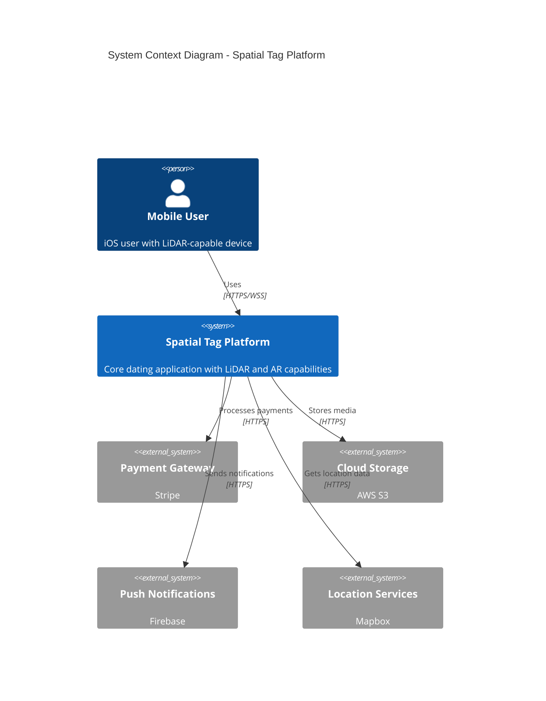

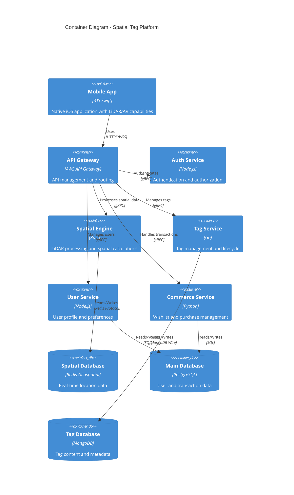

## 2.2 Component Details

### 2.2.1 Core Components

| Component | Purpose | Technology Stack | Scaling Strategy |
| --- | --- | --- | --- |
| Mobile App | Client application | Swift, ARKit, Core Location | N/A - Client-side |
| API Gateway | Request routing and management | AWS API Gateway | Auto-scaling based on request volume |
| Spatial Engine | LiDAR processing and spatial calculations | Rust, CUDA | Horizontal scaling with load balancing |
| Tag Service | Tag lifecycle management | Go, gRPC | Kubernetes horizontal pod autoscaling |
| User Service | Profile and preference management | Node.js, Express | Container-based scaling |
| Commerce Service | Transaction and wishlist handling | Python, FastAPI | Microservice replication |

### 2.2.2 Data Storage Components

| Component | Technology | Purpose | Scaling Strategy |
| --- | --- | --- | --- |
| Spatial Database | Redis Geospatial | Real-time location data | Redis Cluster with sharding |
| Main Database | PostgreSQL | User and transaction data | Primary-replica with read replicas |
| Tag Database | MongoDB | Tag content and metadata | Sharded clusters |
| Cache Layer | Redis | Application caching | Redis Cluster |
| Object Storage | AWS S3 | Media storage | Native AWS scaling |

## 2.3 Technical Decisions

### 2.3.1 Architecture Patterns

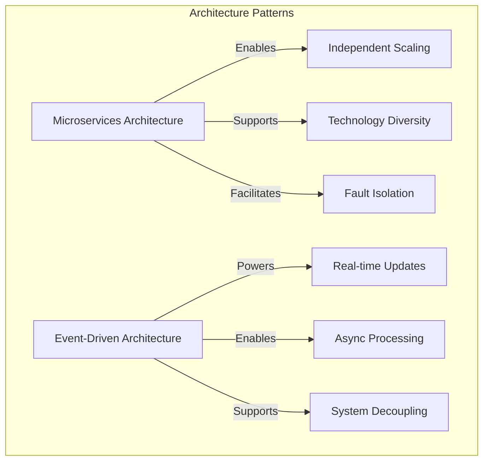

### 2.3.2 Communication Patterns

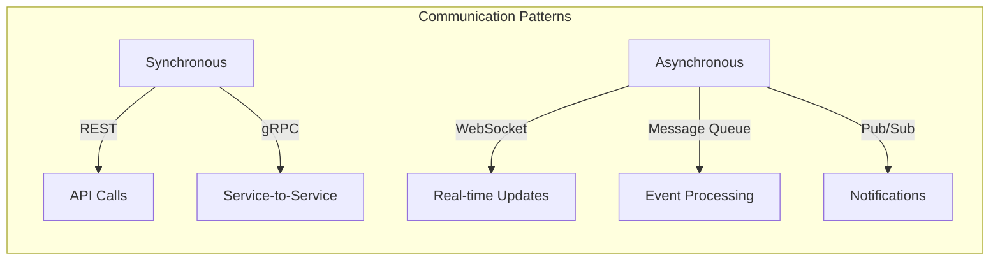

## 2.4 Cross-Cutting Concerns

### 2.4.1 Monitoring and Observability

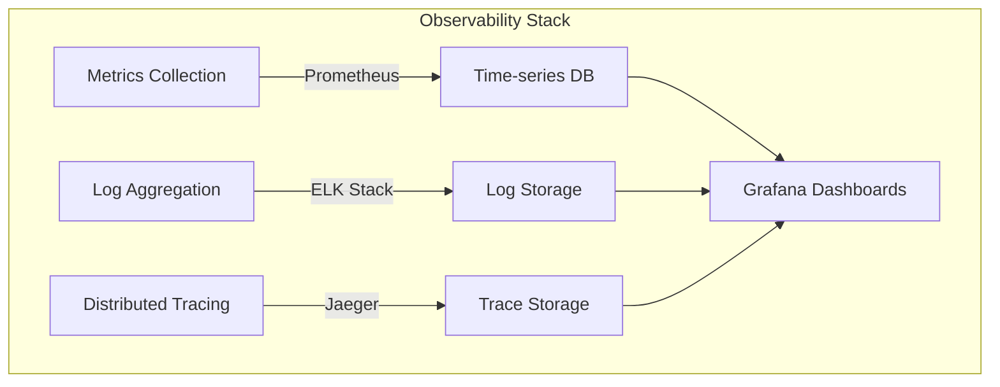

### 2.4.2 Security Architecture

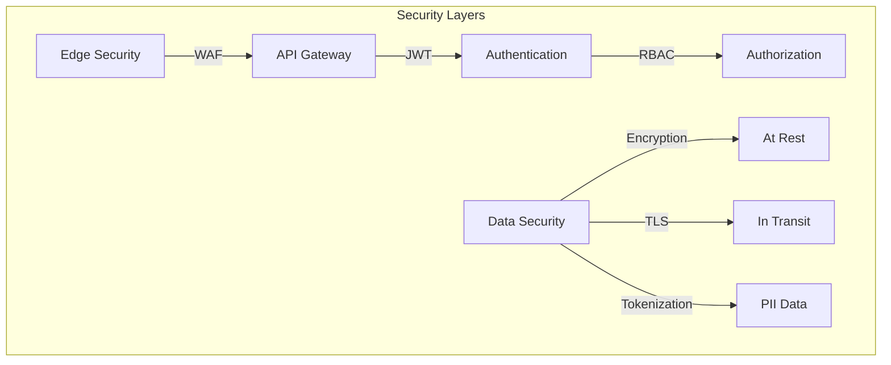

## 2.5 Deployment Architecture

```mermaid
C4Deployment
    title Deployment Diagram - Spatial Tag Platform

    Deployment_Node(cdn, "Content Delivery", "CloudFront"){
        Container(static, "Static Assets", "Media and static content")
    }
    
    Deployment_Node(mobile, "User Device", "iOS"){
        Container(app, "Mobile App", "Native iOS application")
    }
    
    Deployment_Node(aws, "AWS Cloud", "Production"){
        Deployment_Node(eks, "Kubernetes Cluster", "EKS"){
            Container(services, "Microservices", "Container pods")
        }
        Deployment_Node(dbs, "Database Cluster", "Multi-AZ"){
            ContainerDb(db, "Databases", "PostgreSQL, MongoDB, Redis")
        }
    }
    
    Rel(mobile, cdn, "Fetches assets", "HTTPS")
    Rel(mobile, aws, "API calls", "HTTPS/WSS")
    Rel(eks, dbs, "Reads/Writes", "Internal")
```

# 3. SYSTEM COMPONENTS ARCHITECTURE

## 3.1 USER INTERFACE DESIGN

### 3.1.1 Design Specifications

| Category | Requirements |
| --- | --- |
| Visual Hierarchy | - Dark theme primary with high contrast AR elements<br>- Floating action buttons for core functions<br>- Minimalist, gesture-driven interface<br>- Status indicators with clear visual hierarchy |
| Component Library | - Custom AR overlay components<br>- Spatial tag visualization system<br>- Distance-based interaction elements<br>- Status badges and indicators |
| Responsive Design | - Portrait and landscape orientation support<br>- Dynamic scaling for different iPhone Pro models<br>- Adaptive AR overlay positioning |
| Accessibility | - WCAG 2.1 Level AA compliance<br>- VoiceOver support for all interactions<br>- Haptic feedback for spatial awareness<br>- High contrast mode support |
| Device Support | - iPhone 12 Pro and newer<br>- iOS 15.0 minimum<br>- LiDAR sensor required |
| Theme Support | - System-wide dark mode by default<br>- AR overlay contrast optimization<br>- Custom accent colors for status levels |

### 3.1.2 Interface Elements

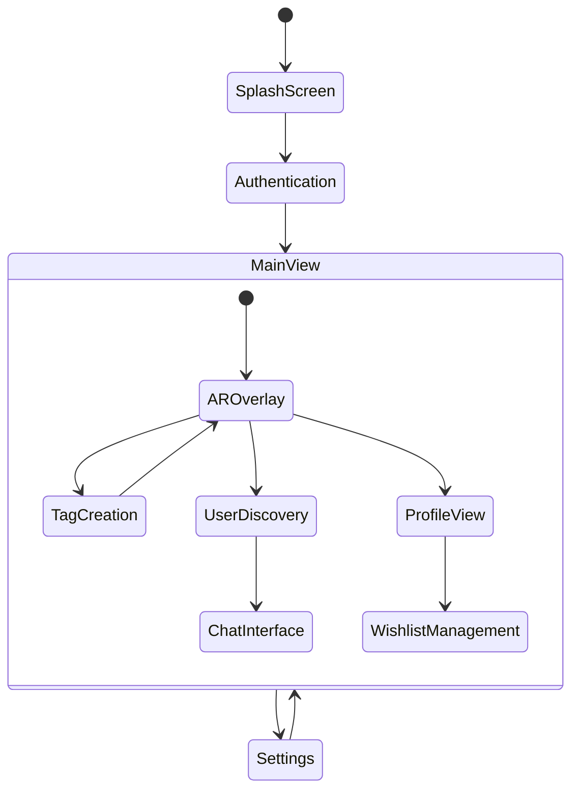

### 3.1.3 Critical User Flows

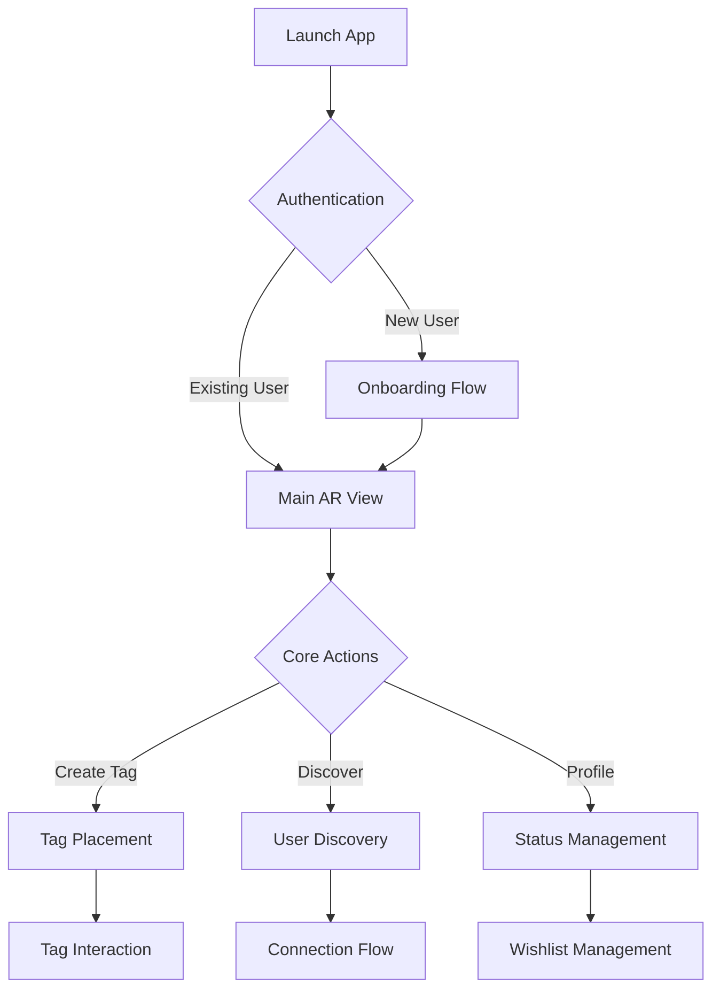

## 3.2 DATABASE DESIGN

### 3.2.1 Schema Design

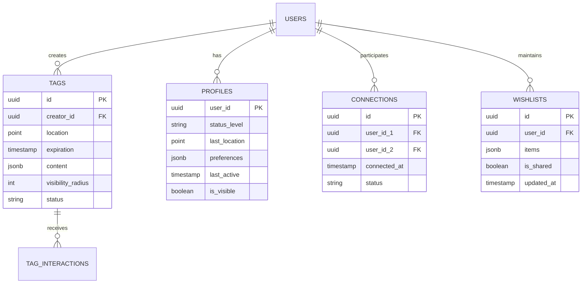

### 3.2.2 Data Management Strategy

| Aspect | Implementation |
| --- | --- |
| Partitioning | - Location-based sharding for spatial data<br>- Time-based partitioning for tags<br>- User ID range partitioning |
| Indexing | - Geospatial indexes for location queries<br>- B-tree indexes for user lookups<br>- Composite indexes for tag searches |
| Caching | - Redis for spatial data (1 hour TTL)<br>- Application-level cache for user profiles<br>- CDN for media content |
| Backup | - Hourly incremental backups<br>- Daily full backups<br>- 30-day retention period |
| Archival | - Tag data archived after expiration<br>- Interaction history after 90 days<br>- User data retained indefinitely |

## 3.3 API DESIGN

### 3.3.1 API Architecture

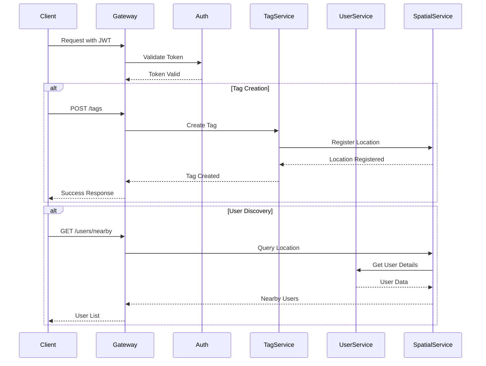

### 3.3.2 API Specifications

| Endpoint Category | Authentication | Rate Limit | Caching |
| --- | --- | --- | --- |
| User Management | JWT Bearer | 100/min | 5 min |
| Tag Operations | JWT Bearer | 50/min | 1 min |
| Spatial Queries | JWT Bearer | 200/min | 30 sec |
| Wishlist Management | JWT Bearer | 50/min | 2 min |
| Status Updates | JWT Bearer | 20/min | None |

### 3.3.3 Integration Requirements

| System | Integration Method | Requirements |
| --- | --- | --- |
| Payment Gateway | REST API | - PCI DSS compliance<br>- 3D Secure support<br>- Webhook handling |
| Location Services | gRPC | - Real-time updates<br>- Bi-directional streaming<br>- Error recovery |
| Media Storage | S3 API | - Direct upload<br>- CDN integration<br>- Access control |
| Push Notifications | HTTP/2 | - Topic support<br>- Silent notifications<br>- Delivery tracking |

# 4. TECHNOLOGY STACK

## 4.1 PROGRAMMING LANGUAGES

| Platform/Component | Language | Version | Justification |
| --- | --- | --- | --- |
| iOS Client | Swift | 5.9+ | - Native LiDAR/ARKit support<br>- High performance for real-time processing<br>- First-class Apple framework integration |
| Spatial Engine | Rust | 1.74+ | - Low-level performance for LiDAR processing<br>- Memory safety for spatial calculations<br>- Excellent concurrency support |
| Tag Service | Go | 1.21+ | - High throughput for tag operations<br>- Excellent support for microservices<br>- Strong standard library |
| User Service | Node.js | 20 LTS | - Efficient handling of user operations<br>- Large ecosystem for auth/profile management<br>- Async processing capabilities |
| Commerce Service | Python | 3.11+ | - Rich ecosystem for payment processing<br>- Strong data processing capabilities<br>- Excellent third-party library support |

## 4.2 FRAMEWORKS & LIBRARIES

### Core Frameworks

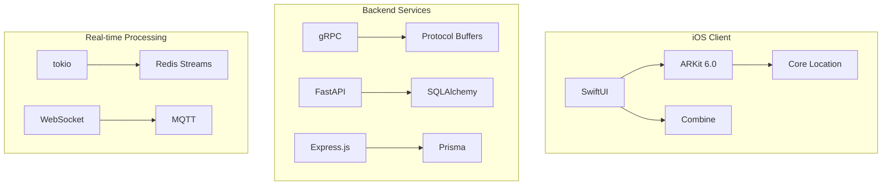

| Component | Framework | Version | Purpose |
| --- | --- | --- | --- |
| iOS AR | ARKit | 6.0 | LiDAR and AR capabilities |
| API Gateway | AWS API Gateway | 2.0 | Request routing and management |
| Spatial Processing | tokio | 1.32 | Async runtime for Rust |
| Data Access | SQLAlchemy | 2.0 | ORM for PostgreSQL |
| Real-time Comms | WebSocket | 8.0 | Bi-directional communication |

## 4.3 DATABASES & STORAGE

### Database Architecture

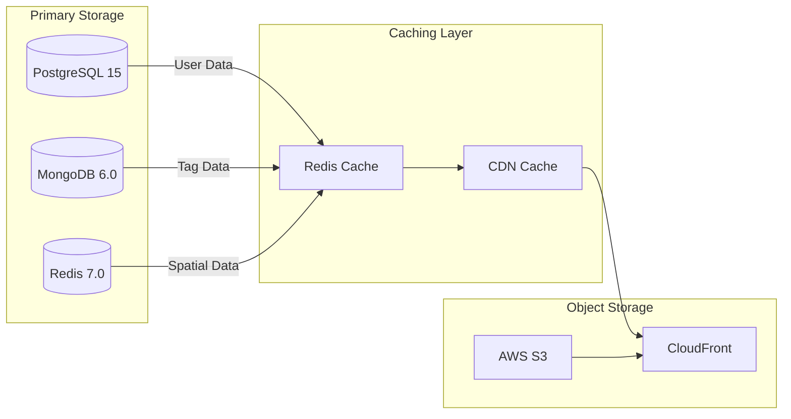

| Data Type | Storage Solution | Justification |
| --- | --- | --- |
| User Profiles | PostgreSQL 15 | ACID compliance, relational integrity |
| Spatial Data | Redis Geospatial | Real-time spatial queries, in-memory performance |
| Tag Content | MongoDB 6.0 | Flexible schema, geospatial indexing |
| Media Assets | AWS S3 | Scalable object storage, CDN integration |
| Cache Layer | Redis Cluster | Distributed caching, pub/sub support |

## 4.4 THIRD-PARTY SERVICES

### Service Integration Architecture

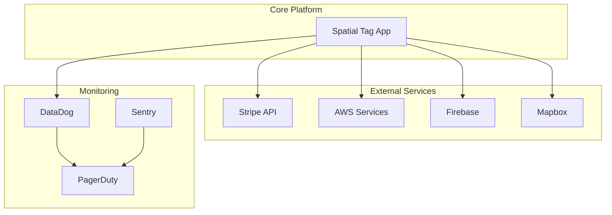

| Service Category | Provider | Purpose |
| --- | --- | --- |
| Payment Processing | Stripe v2023-10 | Secure payment handling |
| Push Notifications | Firebase Cloud Messaging | Real-time user alerts |
| Monitoring | DataDog | Performance monitoring |
| Error Tracking | Sentry | Error reporting and tracking |
| Maps & Location | Mapbox GL | Location visualization |

## 4.5 DEVELOPMENT & DEPLOYMENT

### CI/CD Pipeline

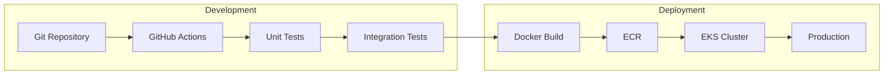

| Category | Tool | Version | Purpose |
| --- | --- | --- | --- |
| Source Control | Git | 2.42+ | Version control |
| CI/CD | GitHub Actions | Latest | Automated pipeline |
| Containerization | Docker | 24.0+ | Application packaging |
| Orchestration | Kubernetes | 1.27+ | Container orchestration |
| Infrastructure | Terraform | 1.6+ | Infrastructure as code |
| Monitoring | Prometheus/Grafana | Latest | System monitoring |

### Development Tools

| Category | Tool | Purpose |
| --- | --- | --- |
| IDE | Xcode 15+ | iOS development |
| API Testing | Postman | API development |
| Performance | Instruments | iOS profiling |
| Documentation | SwiftDoc | Code documentation |
| Code Quality | SonarQube | Code analysis |

# 5. SYSTEM DESIGN

## 5.1 USER INTERFACE DESIGN

### 5.1.1 Core Interface Components

| Screen | Primary Elements | Interactions |
| --- | --- | --- |
| AR View | - LiDAR overlay<br>- Tag indicators<br>- User proximity markers<br>- Status badges | - Tap to view tag details<br>- Long press to create tag<br>- Swipe to filter view |
| Profile | - Status level display<br>- Tag history<br>- Wishlist preview<br>- Interaction stats | - Scroll for history<br>- Tap to edit<br>- Share profile |
| Tag Creation | - AR placement guide<br>- Media attachment<br>- Expiration selector<br>- Visibility controls | - Drag to position<br>- Gesture scaling<br>- Quick templates |

### 5.1.2 Interface Flow

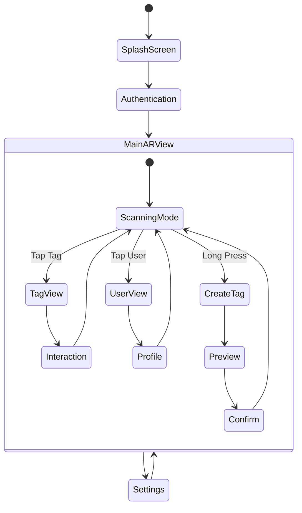

## 5.2 DATABASE DESIGN

### 5.2.1 Schema Design


### 5.2.2 Storage Strategy

| Data Type | Storage Solution | Justification |
| --- | --- | --- |
| User Profiles | PostgreSQL | ACID compliance, relational integrity |
| Spatial Data | Redis Geospatial | Real-time queries, in-memory performance |
| Tags | MongoDB | Flexible schema, geospatial indexing |
| Media Assets | S3 | Scalable object storage, CDN integration |
| Cache Layer | Redis Cluster | Distributed caching, pub/sub support |

## 5.3 API DESIGN

### 5.3.1 API Architecture

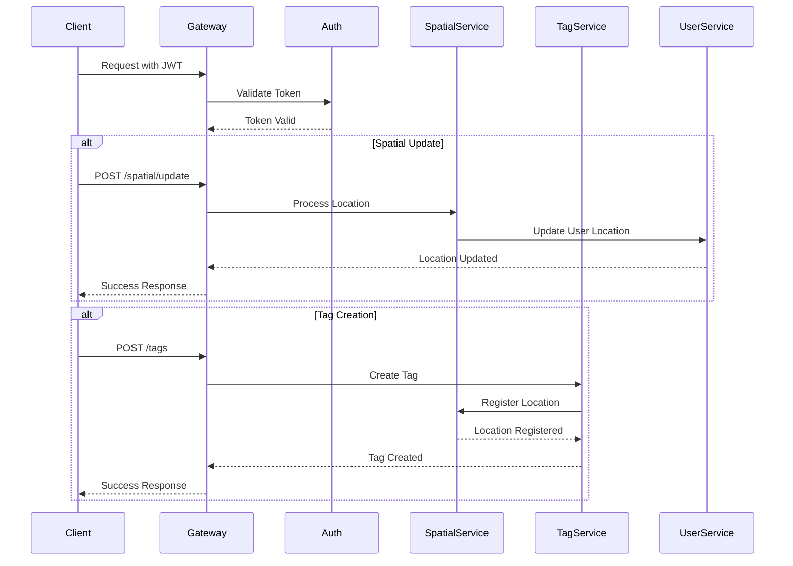

### 5.3.2 API Endpoints

| Category | Endpoint | Method | Purpose |
| --- | --- | --- | --- |
| Authentication | /auth/login | POST | User authentication |
| Spatial | /spatial/update | POST | Update user location |
| Tags | /tags | POST | Create new tag |
| Tags | /tags/nearby | GET | Get nearby tags |
| Users | /users/discover | GET | Find nearby users |
| Profile | /profile | PUT | Update user profile |
| Wishlist | /wishlist | POST | Manage wishlist |

### 5.3.3 Real-time Communication

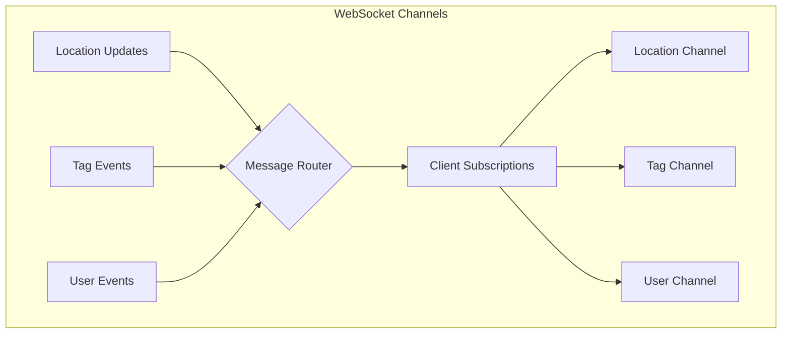

### 5.3.4 API Security

| Security Layer | Implementation |
| --- | --- |
| Authentication | JWT with refresh tokens |
| Rate Limiting | 100 requests/minute |
| Input Validation | JSON Schema validation |
| Data Encryption | TLS 1.3 |
| Access Control | RBAC with scopes |

# 6. USER INTERFACE DESIGN

## 6.1 Design System

### Icon Key

```
[?] Help/Information
[$] Payment/Transaction
[i] Information
[+] Add/Create
[x] Close/Delete
[<] Previous
[>] Next
[^] Upload
[#] Menu/Dashboard
[@] User Profile
[!] Alert/Warning
[=] Settings
[*] Favorite/Important
```

### Input Elements

```
[ ] Checkbox
( ) Radio Button
[Button] Action Button
[...] Text Input Field
[====] Progress Bar
[v] Dropdown Menu
```

## 6.2 Core Screens

### 6.2.1 AR Main View

```
+------------------------------------------+
|[@] Elite      [#]     [$]     [=]     [?]|
+------------------------------------------+
|                                          |
|         [!] 3 Users Nearby               |
|                                          |
|            [@] John D.                   |
|            10.2m away                    |
|            [*] 98% Match                 |
|                                          |
|     [@] Sarah P.                         |
|     24.1m away                          |
|     [Tag: Art Gallery]                   |
|                                          |
|                  [@] Mike R.             |
|                  31.5m away              |
|                  [Tag: Coffee Shop]      |
|                                          |
+------------------------------------------+
|    [<]    [+] New Tag    [@] Profile    |
+------------------------------------------+
```

### 6.2.2 Tag Creation

```
+------------------------------------------+
|[x] Cancel                    [Save Button]|
+------------------------------------------+
|                                          |
|  Tag Title:                              |
|  [............................]          |
|                                          |
|  Description:                            |
|  [............................]          |
|  [............................]          |
|                                          |
|  Visibility:                             |
|  [v] Public                              |
|                                          |
|  Duration:                               |
|  ( ) 1 Hour                              |
|  ( ) 4 Hours                             |
|  (•) 24 Hours                            |
|                                          |
|  Media:                                  |
|  [^ Upload Photo/Video]                  |
|                                          |
+------------------------------------------+
```

### 6.2.3 Profile View

```
+------------------------------------------+
|[x] Close                     [=] Settings |
+------------------------------------------+
|                                          |
|  [@] Alex Smith                          |
|  Elite Status [====] 82%                 |
|                                          |
|  Tags Created: 47                        |
|  Connections: 156                        |
|  Rare Achievements: 3                    |
|                                          |
|  Active Tags:                            |
|  +-- [*] Coffee Shop Review             |
|  |   2.4km away • 3h remaining          |
|  +-- [*] Art Gallery Event              |
|      0.8km away • 12h remaining         |
|                                          |
|  Wishlist:                               |
|  +-- Nike Air Max [$249]                |
|  +-- Concert Tickets [$89]              |
|  +-- Restaurant Booking [$150]          |
|                                          |
+------------------------------------------+
|    [Edit Profile]    [Share Wishlist]    |
+------------------------------------------+
```

### 6.2.4 Discovery Feed

```
+------------------------------------------+
|[#] Menu                    [@] Profile   |
+------------------------------------------+
|  [v] Filter By: Nearby Tags             |
|                                          |
|  +--------------------------------+      |
|  | [@] James K. • 5min ago        |      |
|  | Coffee Meetup Tag              |      |
|  | 0.3km away • 3h remaining      |      |
|  | [View Tag] [* Save]            |      |
|  +--------------------------------+      |
|                                          |
|  +--------------------------------+      |
|  | [@] Emma R. • 15min ago        |      |
|  | Art Exhibition Opening         |      |
|  | 1.2km away • 8h remaining      |      |
|  | [View Tag] [* Save]            |      |
|  +--------------------------------+      |
|                                          |
|  [Load More...]                          |
+------------------------------------------+
```

## 6.3 Interaction States

### 6.3.1 Tag Interaction Flow

```
+------------------------------------------+
|                                          |
|  +-- Initial State                       |
|      [Tap to View Tag]                   |
|                                          |
|  +-- Preview State                       |
|      [Quick Info + Actions]              |
|                                          |
|  +-- Full View State                     |
|      [Complete Tag Details]              |
|      [Interaction Options]               |
|                                          |
|  +-- Action State                        |
|      [Response Options]                  |
|      [Share Controls]                    |
|                                          |
+------------------------------------------+
```

### 6.3.2 User Discovery Flow

```
+------------------------------------------+
|                                          |
|  +-- Detection                           |
|      [@] User Icon Appears              |
|                                          |
|  +-- Proximity Alert                     |
|      [!] User Within Range              |
|                                          |
|  +-- Profile Preview                     |
|      [Basic Info + Match %]             |
|                                          |
|  +-- Interaction Options                 |
|      [Message] [View Profile] [Block]    |
|                                          |
+------------------------------------------+
```

## 6.4 Responsive Behaviors

### 6.4.1 Orientation Changes

```
Portrait:                    Landscape:
+------------------+        +-------------------------+
| [@]    [#]  [=] |        | [@] [#] [=]            |
|                 |        |                         |
| Content Area    |        | Content     | Secondary |
|                 |        | Area        | Panel     |
|                 |        |             |           |
| [Navigation]    |        | [Navigation]            |
+------------------+        +-------------------------+
```

### 6.4.2 Distance-Based UI Scaling

```
Near (0-10m):              Far (10m+):
+------------------+        +------------------+
| [@] Large Icon   |        | [@] Small Icon  |
| Detailed Info    |        | Basic Info      |
| All Actions      |        | Limited Actions |
+------------------+        +------------------+
```

# 7. SECURITY CONSIDERATIONS

## 7.1 AUTHENTICATION AND AUTHORIZATION

### 7.1.1 Authentication Flow

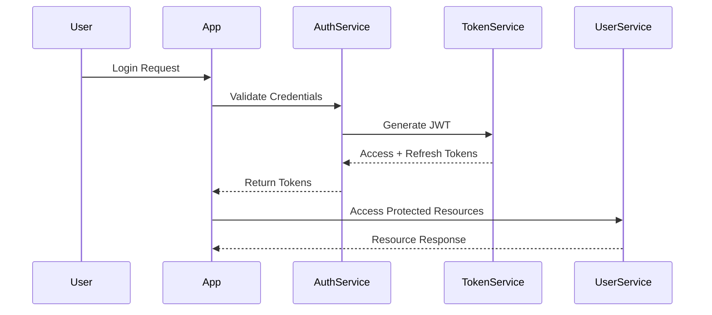

### 7.1.2 Authentication Methods

| Method | Implementation | Use Case |
| --- | --- | --- |
| OAuth 2.0 | Social login (Apple, Google) | Primary authentication |
| Email + Password | Argon2id hashing | Alternative login |
| Biometric | Face ID/Touch ID | Device-level authentication |
| SMS/Email OTP | Time-based codes | Two-factor authentication |
| Refresh Tokens | JWT with 7-day expiry | Session management |

### 7.1.3 Authorization Levels

| Role | Permissions | Access Scope |
| --- | --- | --- |
| Basic User | - Create/view tags<br>- Basic interactions<br>- Profile management | Limited to personal data and public tags |
| Elite User | - Extended tag lifetime<br>- Premium features<br>- Advanced analytics | Additional feature access |
| Moderator | - Content moderation<br>- User reports<br>- Tag management | Moderation tools access |
| Admin | - Full system access<br>- User management<br>- System configuration | Complete platform access |

## 7.2 DATA SECURITY

### 7.2.1 Data Classification

| Data Type | Classification | Protection Level |
| --- | --- | --- |
| User Credentials | Critical | - AES-256 encryption<br>- Secure enclave storage<br>- Salt and pepper hashing |
| Location Data | Sensitive | - Encrypted at rest<br>- Anonymized after 24h<br>- Geofencing restrictions |
| Payment Information | Critical | - PCI DSS compliance<br>- Tokenization<br>- Third-party processing |
| Profile Data | Private | - Encrypted storage<br>- Access control<br>- Data minimization |
| Tag Content | Public/Private | - Content encryption<br>- Access controls<br>- Expiration enforcement |

### 7.2.2 Encryption Implementation

```mermaid
flowchart TD
    A[Data Input] --> B{Classification Check}
    B -->|Critical| C[Hardware Security Module]
    B -->|Sensitive| D[Software Encryption]
    B -->|Public| E[Standard Storage]
    
    C --> F[AES-256 Encryption]
    D --> G[TLS 1.3 Transport]
    
    F --> H[Secure Storage]
    G --> H
    E --> I[CDN/Cache]
    
    H --> J[Access Control]
    I --> J
```

## 7.3 SECURITY PROTOCOLS

### 7.3.1 Network Security

| Protocol | Implementation | Purpose |
| --- | --- | --- |
| TLS 1.3 | Mandatory for all connections | Transport security |
| Certificate Pinning | SHA-256 certificates | Man-in-middle prevention |
| DNS-over-HTTPS | Cloudflare/Google DNS | DNS security |
| IP Filtering | Geographic restrictions | Access control |
| Rate Limiting | Token bucket algorithm | DDoS protection |

### 7.3.2 Application Security

```mermaid
flowchart LR
    subgraph Security Layers
        A[Input Validation] --> B[XSS Prevention]
        B --> C[CSRF Protection]
        C --> D[SQL Injection Prevention]
        
        E[Security Headers] --> F[Content Security Policy]
        F --> G[HSTS]
        
        H[Monitoring] --> I[Audit Logging]
        I --> J[Intrusion Detection]
    end
```

### 7.3.3 Operational Security Measures

| Measure | Implementation | Frequency |
| --- | --- | --- |
| Security Scanning | SonarQube, OWASP ZAP | Daily automated scans |
| Vulnerability Assessment | Third-party penetration testing | Quarterly |
| Code Analysis | Static and dynamic analysis | Pre-deployment |
| Access Review | User permission audit | Monthly |
| Security Updates | Automated patching system | Weekly |
| Incident Response | 24/7 monitoring and alerting | Real-time |

### 7.3.4 Compliance Requirements

| Standard | Requirements | Implementation |
| --- | --- | --- |
| GDPR | - Data minimization<br>- Right to be forgotten<br>- Data portability | - Automated data cleanup<br>- Self-service deletion<br>- Export API |
| CCPA | - Data disclosure<br>- Opt-out rights<br>- Minor protection | - Privacy dashboard<br>- Consent management<br>- Age verification |
| PCI DSS | - Secure transmission<br>- Access control<br>- Monitoring | - Tokenization<br>- Audit logging<br>- Intrusion detection |
| SOC 2 | - Security controls<br>- Availability<br>- Confidentiality | - Access reviews<br>- Monitoring<br>- Encryption |

# 8. INFRASTRUCTURE

## 8.1 DEPLOYMENT ENVIRONMENT

### 8.1.1 Environment Overview

| Environment | Purpose | Configuration |
| --- | --- | --- |
| Development | Feature development and testing | Single region, minimal redundancy |
| Staging | Pre-production validation | Multi-AZ, production-like setup |
| Production | Live user environment | Multi-region, full redundancy |
| DR | Disaster recovery | Hot standby in alternate region |

### 8.1.2 Regional Distribution

```mermaid
flowchart TD
    subgraph Primary Region
        A[US East Load Balancer] --> B[Application Cluster]
        B --> C[(Primary Database)]
        B --> D[Cache Layer]
    end
    
    subgraph Secondary Region
        E[US West Load Balancer] --> F[Application Cluster]
        F --> G[(Replica Database)]
        F --> H[Cache Layer]
    end
    
    subgraph EU Region
        I[EU Load Balancer] --> J[Application Cluster]
        J --> K[(Replica Database)]
        J --> L[Cache Layer]
    end
    
    C -.-> G
    C -.-> K
```

## 8.2 CLOUD SERVICES

### 8.2.1 AWS Service Stack

| Service | Purpose | Configuration |
| --- | --- | --- |
| EKS | Container orchestration | Multi-AZ, managed nodes |
| RDS | PostgreSQL databases | Multi-AZ, auto-scaling |
| DocumentDB | MongoDB-compatible database | Cluster with 3 replicas |
| ElastiCache | Redis for caching/spatial | Cluster mode enabled |
| S3 | Object storage | Cross-region replication |
| CloudFront | CDN for static assets | Global edge locations |
| Route53 | DNS management | Latency-based routing |
| ACM | SSL/TLS certificates | Auto-renewal enabled |

### 8.2.2 Service Architecture

```mermaid
flowchart LR
    subgraph Edge Layer
        A[CloudFront] --> B[Route53]
        C[WAF] --> A
    end
    
    subgraph Application Layer
        B --> D[ALB]
        D --> E[EKS Cluster]
    end
    
    subgraph Data Layer
        E --> F[(RDS)]
        E --> G[(DocumentDB)]
        E --> H[(ElastiCache)]
    end
    
    subgraph Storage Layer
        E --> I[S3]
        I --> J[Glacier]
    end
```

## 8.3 CONTAINERIZATION

### 8.3.1 Container Strategy

| Component | Base Image | Resource Limits |
| --- | --- | --- |
| API Gateway | nginx:alpine | 1 CPU, 2GB RAM |
| Spatial Engine | rust:1.74-slim | 2 CPU, 4GB RAM |
| Tag Service | golang:1.21-alpine | 1 CPU, 2GB RAM |
| User Service | node:20-alpine | 1 CPU, 2GB RAM |
| Commerce Service | python:3.11-slim | 1 CPU, 2GB RAM |

### 8.3.2 Container Architecture

```mermaid
flowchart TD
    subgraph Docker Registry
        A[ECR] --> B[Container Images]
    end
    
    subgraph Kubernetes Cluster
        C[Ingress Controller] --> D[Service Mesh]
        D --> E[Application Pods]
        D --> F[Background Jobs]
        D --> G[Scheduled Tasks]
    end
    
    B --> C
```

## 8.4 ORCHESTRATION

### 8.4.1 Kubernetes Configuration

| Resource Type | Purpose | Scaling Strategy |
| --- | --- | --- |
| Deployments | Stateless services | HPA based on CPU/Memory |
| StatefulSets | Stateful components | Manual scaling |
| DaemonSets | Cluster-wide services | Node-based scaling |
| CronJobs | Scheduled tasks | Time-based execution |

### 8.4.2 Cluster Architecture

```mermaid
flowchart TD
    subgraph EKS Cluster
        A[Ingress] --> B[Service Mesh]
        
        subgraph Application Namespace
            B --> C[API Gateway]
            B --> D[Spatial Engine]
            B --> E[Tag Service]
            B --> F[User Service]
            B --> G[Commerce Service]
        end
        
        subgraph System Namespace
            H[Monitoring]
            I[Logging]
            J[Cert Manager]
        end
    end
```

## 8.5 CI/CD PIPELINE

### 8.5.1 Pipeline Overview

```mermaid
flowchart LR
    A[Source Code] --> B[Build]
    B --> C[Test]
    C --> D[Security Scan]
    D --> E[Package]
    E --> F[Deploy to Dev]
    F --> G[Integration Tests]
    G --> H[Deploy to Staging]
    H --> I[E2E Tests]
    I --> J[Deploy to Prod]
```

### 8.5.2 Pipeline Stages

| Stage | Tools | Success Criteria |
| --- | --- | --- |
| Build | GitHub Actions | Successful compilation |
| Test | Jest, Rust Test | 100% pass rate |
| Security | SonarQube, Snyk | No critical issues |
| Package | Docker, ECR | Image scan passed |
| Deploy | ArgoCD | Health check passed |
| Monitor | Datadog | No critical alerts |

### 8.5.3 Deployment Strategy

| Environment | Strategy | Rollback Time |
| --- | --- | --- |
| Development | Direct deployment | Immediate |
| Staging | Blue/Green | \< 5 minutes |
| Production | Canary | \< 15 minutes |
| DR | Failover | \< 30 minutes |

# 8. APPENDICES

## 8.1 ADDITIONAL TECHNICAL INFORMATION

### 8.1.1 LiDAR Performance Specifications

| Parameter | Specification | Notes |
| --- | --- | --- |
| Scanning Range | 0.5m - 50m | Optimal range for user detection |
| Refresh Rate | 30Hz minimum | Required for smooth AR overlay |
| Precision | ±1cm at 10m | For accurate tag placement |
| Field of View | 120° horizontal | Matches iPhone Pro LiDAR specs |
| Power Usage | 0.8W average | Under normal operation |

### 8.1.2 Status System Calculation

```mermaid
flowchart TD
    A[User Actions] --> B{Point System}
    B --> C[Tag Creation]
    B --> D[Interactions]
    B --> E[Commerce]
    
    C --> F[+10 points/tag]
    D --> G[+5 points/interaction]
    E --> H[+20 points/purchase]
    
    F --> I{Weekly Total}
    G --> I
    H --> I
    
    I -->|>500 points| J[Elite Status]
    I -->|>1000 points| K[Rare Status]
    I -->|<500 points| L[Regular Status]
```

### 8.1.3 Cache Strategy

| Data Type | Cache Duration | Invalidation Strategy |
| --- | --- | --- |
| User Location | 30 seconds | Time-based expiry |
| Tag Data | 5 minutes | On update or expiry |
| Profile Info | 1 hour | On user update |
| AR Assets | 24 hours | Version-based |
| Spatial Maps | 12 hours | Location change |

## 8.2 GLOSSARY

| Term | Definition |
| --- | --- |
| Spatial Engine | Core system component processing LiDAR data and managing spatial relationships |
| Tag Anchor | Fixed spatial coordinate where a digital tag is placed |
| Discovery Radius | Maximum distance within which users can detect others' tags |
| Elite Threshold | Minimum activity level required to achieve Elite status |
| Interaction Zone | Defined area where users can engage with tags or other users |
| Spatial Hash | Geographic indexing method for efficient location queries |
| Tag Expiry | Automatic removal of tags after their set duration |
| Visibility Radius | User-defined range for tag visibility |
| Wishlist Sync | Process of updating shared shopping lists between users |
| AR Persistence | Maintenance of AR elements across sessions |
| Spatial Mesh | 3D representation of environment from LiDAR data |
| Tag Density | Number of active tags per square meter |

## 8.3 ACRONYMS

| Acronym | Full Form |
| --- | --- |
| ARKit | Augmented Reality Kit |
| CUDA | Compute Unified Device Architecture |
| EKS | Elastic Kubernetes Service |
| gRPC | Google Remote Procedure Call |
| HSTS | HTTP Strict Transport Security |
| JWT | JSON Web Token |
| LiDAR | Light Detection and Ranging |
| MQTT | Message Queuing Telemetry Transport |
| ORM | Object-Relational Mapping |
| PII | Personally Identifiable Information |
| RBAC | Role-Based Access Control |
| S3 | Simple Storage Service |
| TLS | Transport Layer Security |
| WAF | Web Application Firewall |
| WSS | WebSocket Secure |
| XSS | Cross-Site Scripting |

## 8.4 REFERENCE ARCHITECTURE

```mermaid
flowchart TD
    subgraph Client Layer
        A[iOS App] --> B[ARKit]
        A --> C[LiDAR]
        A --> D[Core Location]
    end
    
    subgraph API Layer
        E[API Gateway] --> F[Auth Service]
        E --> G[Spatial Engine]
        E --> H[Tag Service]
    end
    
    subgraph Data Layer
        I[(PostgreSQL)] --> J[(Redis)]
        J --> K[(MongoDB)]
        K --> L[S3]
    end
    
    subgraph Monitoring
        M[Prometheus] --> N[Grafana]
        O[ELK Stack] --> N
    end
    
    A --> E
    E --> I
    G --> J
    H --> K
```