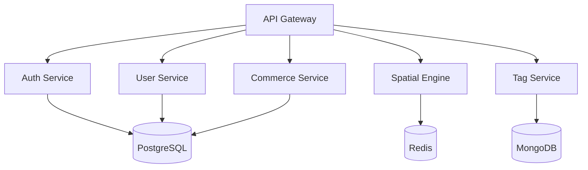

# Spatial Tag Backend Architecture

## Table of Contents
- [Overview](#overview)
- [Architecture](#architecture)
- [Development](#development)
- [Operations](#operations)

## Overview

Spatial Tag is a revolutionary LiDAR-enabled dating platform that leverages spatial awareness and augmented reality for authentic user connections. This document outlines the backend architecture, development practices, and operational procedures.

### Technology Stack

#### Core Services
- **API Gateway**: TypeScript/Node.js (v20 LTS)
- **Spatial Engine**: Rust (v1.74+)
- **Tag Service**: Go (v1.21+)
- **User Service**: Node.js (v20 LTS)
- **Commerce Service**: Python (v3.11+)

#### Databases
- **PostgreSQL 15**: User and transaction data
- **Redis 7.0**: Spatial data and caching
- **MongoDB 6.0**: Tag content and metadata

#### Infrastructure
- **Container Orchestration**: Kubernetes (EKS)
- **Service Mesh**: Istio
- **Monitoring**: Datadog APM
- **Logging**: ELK Stack

## Architecture

### Service Architecture



### Service Specifications

#### API Gateway
- Port: 3000
- Scaling: Horizontal auto-scaling
- Responsibilities:
  - Request routing
  - Authentication
  - Rate limiting (100 req/min)
  - API documentation (OpenAPI 3.0)
  - Request validation
  - Response caching

#### Spatial Engine
- Port: 50051
- Scaling: Vertical with GPU support
- Responsibilities:
  - LiDAR data processing
  - Spatial calculations
  - Location tracking
  - Real-time optimization
  - Spatial mesh generation

### Database Architecture

#### PostgreSQL
- Version: 15
- Port: 5432
- Replication: Multi-region streaming
- Backup: Continuous WAL archiving
- High Availability: Multi-AZ deployment

#### Redis
- Version: 7.0
- Port: 6379
- Clustering: Redis Cluster
- Persistence: RDB + AOF
- Use Cases:
  - Spatial data indexing
  - Real-time location tracking
  - Session management
  - Rate limiting

## Development

### Environment Setup

1. Clone the repository:
```bash
git clone git@github.com:your-org/spatial-tag.git
cd spatial-tag/backend
```

2. Copy environment template:
```bash
cp .env.example .env
```

3. Start development environment:
```bash
docker-compose up -d
```

### Service Development Guidelines

#### Code Standards
- TypeScript: ESLint + Prettier
- Rust: rustfmt + clippy
- Go: gofmt + golangci-lint
- Python: black + flake8

#### Testing Requirements
- Unit Test Coverage: >90%
- Integration Tests: Required
- Performance Tests: Required for Spatial Engine
- Security Tests: Required for Auth Service

### API Documentation
- OpenAPI 3.0 specification
- Swagger UI at `/api/docs`
- Postman collection maintained
- GraphQL schema documentation

## Operations

### Deployment Environments

| Environment | Purpose | Configuration |
|-------------|---------|---------------|
| Development | Feature development | Single region, minimal redundancy |
| Staging | Pre-production validation | Multi-AZ, production-like |
| Production | Live user environment | Multi-region, full redundancy |
| DR | Disaster recovery | Hot standby in alternate region |

### Security Implementation

#### Authentication Flow
1. JWT-based authentication
2. Refresh token rotation
3. OAuth 2.0 support
4. Rate limiting per endpoint
5. IP-based blocking

#### Data Protection
- TLS 1.3 enforcement
- At-rest encryption (AES-256)
- PII data encryption
- Audit logging
- GDPR compliance

### Monitoring Setup

#### Metrics Collection
- Service metrics: Datadog APM
- Custom metrics: Prometheus
- Visualization: Grafana
- Log aggregation: ELK Stack

#### Alert Configuration
- Service health: PagerDuty
- Error rates: Datadog
- Resource utilization: Custom thresholds
- Security events: SIEM integration

### Backup Strategy

#### Database Backups
- PostgreSQL: Continuous WAL archiving
- MongoDB: Daily snapshots
- Redis: RDB snapshots

#### Retention Policy
- Transaction data: 7 years
- User data: Account lifetime
- Logs: 90 days
- Metrics: 13 months

### Disaster Recovery

#### Recovery Time Objectives
- Critical services: <15 minutes
- Non-critical services: <1 hour
- Data recovery: <30 minutes

#### Failover Process
1. Health check failure detection
2. DNS failover initiation
3. Read replica promotion
4. Service mesh reconfiguration
5. Traffic rerouting

## Compliance Requirements

### Data Protection
- GDPR compliance
- CCPA compliance
- PCI DSS for payment data
- SOC 2 Type II certification

### Security Standards
- OWASP Top 10 mitigation
- Regular penetration testing
- Vulnerability scanning
- Security awareness training

## Contributing

Please refer to [CONTRIBUTING.md](./CONTRIBUTING.md) for development guidelines and contribution process.

## License

Copyright © 2024 Spatial Tag. All rights reserved.