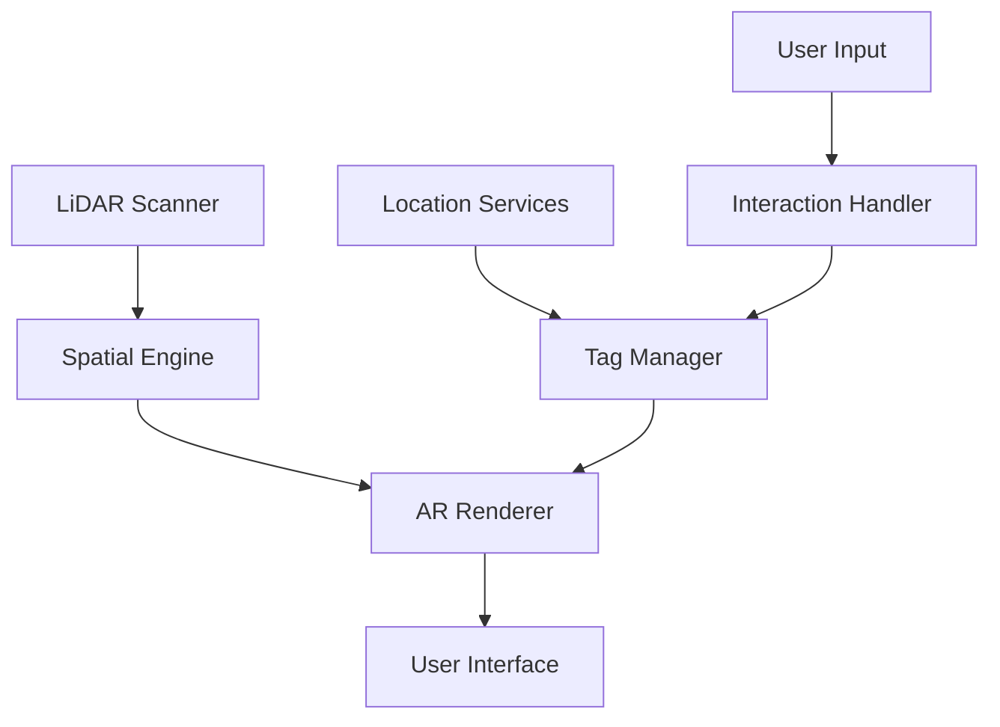

# Spatial Tag iOS Application

## Overview

Spatial Tag is a revolutionary dating application leveraging LiDAR capabilities and spatial awareness for iOS devices. This document provides comprehensive technical documentation for iOS developers working on the Spatial Tag platform.

## Requirements

### Device Requirements
- iPhone 12 Pro or newer
- iOS 15.0+
- LiDAR sensor
- ARKit 6.0 compatibility
- Metal graphics support

### Development Environment
- Xcode 15.0+
- CocoaPods 1.12+
- Swift 5.9+
- Git 2.42+

## Getting Started

### Installation

```bash
# Clone the repository
git clone git@github.com:spatialtag/ios-app.git

# Install dependencies
pod install

# Open workspace
open SpatialTag.xcworkspace
```

### Environment Setup

1. Copy `Configuration/Debug.xcconfig.template` to `Configuration/Debug.xcconfig`
2. Update configuration values with your development credentials
3. Set up signing certificate in Xcode project settings

## Architecture

### Core Components

#### LiDAR Processing
- Real-time environment scanning (30Hz refresh rate)
- Spatial mesh generation with ±1cm precision
- 50-meter detection radius
- Battery optimization for continuous scanning

#### AR Implementation
- ARKit 6.0 integration
- Metal-accelerated rendering
- Spatial anchor persistence
- Real-time occlusion

#### Tag System
- Location-anchored digital markers
- Content management system
- Expiration handling
- Interaction tracking

#### Security Layer
- Face ID integration
- Data encryption
- Secure storage
- Privacy controls

### Data Flow



## Development Guidelines

### LiDAR Implementation

```swift
// Initialize LiDAR session
func configureLiDAR() {
    guard ARWorldTrackingConfiguration.supportsSceneReconstruction(.mesh) else {
        fatalError("Device does not support LiDAR scanning")
    }
    
    let configuration = ARWorldTrackingConfiguration()
    configuration.sceneReconstruction = .mesh
    configuration.frameSemantics = [.sceneDepth, .smoothedSceneDepth]
    
    arSession.run(configuration)
}
```

### AR Best Practices

- Use Metal for rendering optimization
- Implement occlusion for realistic AR
- Cache spatial anchors for persistence
- Handle environment changes gracefully

### Performance Optimization

- Target 60 FPS rendering
- Maintain <100ms response time
- Limit battery drain to <15% per hour
- Optimize mesh resolution dynamically

## Security Implementation

### Authentication
- Face ID integration
- JWT token management
- Secure keychain storage
- Session handling

### Data Protection
- End-to-end encryption
- Secure data persistence
- Privacy-first data handling
- GDPR compliance

## Testing

### Unit Testing
```bash
./ci/test.sh unit
```

### Integration Testing
```bash
./ci/test.sh integration
```

### LiDAR/AR Testing
```bash
./ci/test.sh ar
```

## Deployment

### Development
```bash
./ci/deploy.sh development
```

### TestFlight
```bash
./ci/deploy.sh testflight
```

### Production
```bash
./ci/deploy.sh production
```

## Troubleshooting

### LiDAR Issues
- Verify device compatibility
- Check lighting conditions
- Validate surface materials
- Monitor scanning distance

### AR Problems
- Confirm ARKit configuration
- Check anchor persistence
- Verify tracking quality
- Monitor memory usage

### Performance Issues
- Profile with Instruments
- Check Metal frame capture
- Monitor battery impact
- Analyze network calls

## Dependencies

Key frameworks and versions from Podfile:
- ARKit ~> 6.0
- Firebase/Core ~> 10.0.0
- MapboxMaps
- Stripe
- gRPC-Swift
- RxSwift
- SwiftLint

## Contributing

1. Branch naming: `feature/`, `bugfix/`, `improvement/`
2. Commit message format: `[Type] Description`
3. Required code review by 2 team members
4. CI/CD pipeline must pass
5. Documentation must be updated

## License

Copyright © 2023 Spatial Tag. All rights reserved.